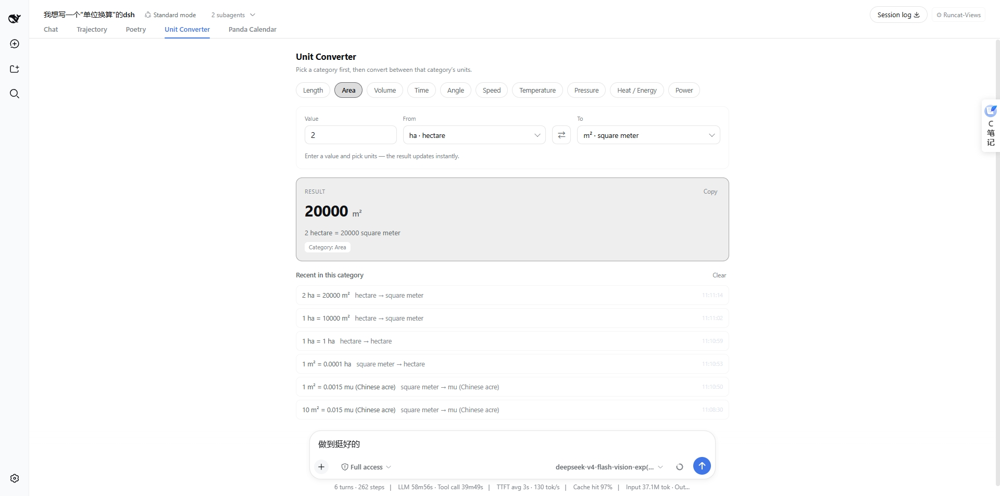
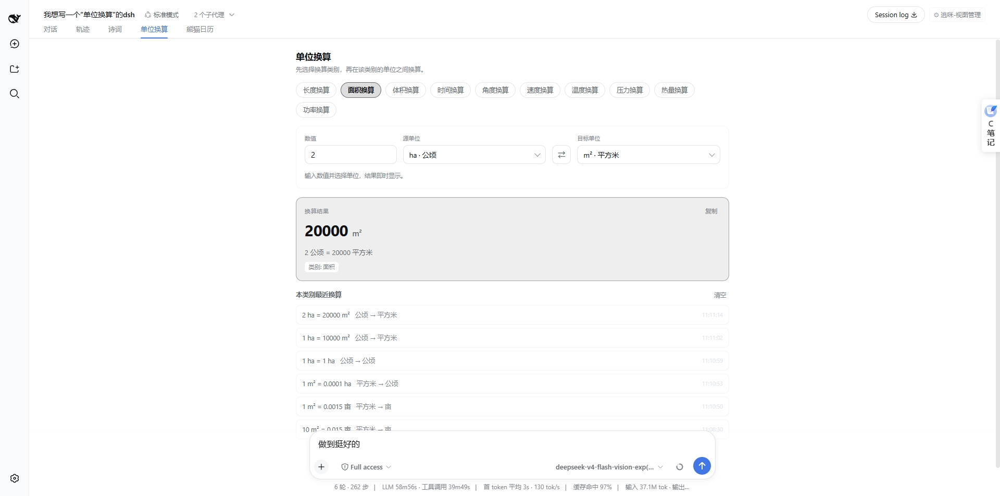

# dsh-unitverse · Unit Converter

English | [中文](README.md)

> The name reads **unit + universe**: ten categories of units in one universe.
> The GUI view tab is still called **单位换算 / Unit Converter**, and the
> model-facing tool is still `convert`.

A **DeepSeek Harness (DSH) unit conversion plugin** exposing one `convert` tool
across **length, area, volume, time, angle, speed, temperature, pressure,
energy/heat and power**, with case-insensitive English and Chinese unit names,
plus both absolute-temperature and temperature-difference (Δ) modes.

## Preview

English UI — one independent module per category, listing only that category's units:



Chinese UI — all copy, category names and unit names in Chinese:



## Features

- ✅ 10 categories, 80+ common units (metric, imperial/US customary, common Chinese units)
- ✅ Lenient unit spelling: `km` / `KM` / `kilometer` / `千米` / `公里` all resolve
- ✅ Absolute temperature (°C / °F / K / °R) and temperature difference (`Δ°C` ↔ `Δ°F`)
- ✅ Pure TypeScript, zero runtime dependencies, side-effect free and unit-testable
- ✅ Results rounded to ~10 significant digits by default
- ✅ Clear errors for unknown units or cross-category requests
- ✅ **Web UI view**: a "Unit Converter" tab next to Conversation / Trajectory
  in the session view bar; the panel is split into ten independent category
  modules (units are never mixed), and all copy — **unit names included** —
  follows the DSH zh/en UI language (since v0.1.0, requires the DSH Web GUI,
  0.1.0-rc.6+)

## Supported categories and units

| Category | Base | Units (symbols) |
| --- | --- | --- |
| length | m | nm, μm, mm, cm, m, km, in, ft, yd, mi, nmi, 里 (li), 尺 (chi) |
| area | m² | mm², cm², m², km², ha, 亩 (mu), in², ft², yd², acre, mi² |
| volume | m³ | mL, L, m³, cm³, in³, ft³, yd³, gal (US), gal (UK), qt (US), bbl |
| time | s | ms, s, min, h, d, wk, mo, yr |
| angle | rad | rad, ° (deg), grad, ′ (arcmin), ″ (arcsec), turn |
| speed | m/s | m/s, km/h, mph, kn (knot), ft/s |
| temperature | K | °C, °F, K, °R (Δ prefix available for differences) |
| pressure | Pa | Pa, kPa, MPa, hPa, bar, atm, psi, Torr, mmHg, inHg |
| energy | J | J, kJ, MJ, cal, kcal, Wh, kWh, BTU |
| power | W | W, kW, MW, GW, hp, PS |

Every unit also accepts its **English full name (including plurals) and its
Chinese name** as aliases — e.g. `ft`, `foot`, `feet` and `英尺` are the same unit.

## Installation

Install it as a DSH bundle (local checkout, tarball or GitHub all work):

```bash
# From a local checkout
dsh plugin --profile <profile-name> add ./dsh-unitverse

# Or from GitHub (build artifacts are committed, so no allowBuilds needed)
dsh plugin --profile <profile-name> add github:runcat-tommy/dsh-unitverse
```

`package.json` declares `dsh.bundle`, so `dsh plugin add` registers the plugin
row from `cordis.patch.yml` automatically.

> The package also ships a browser half: the `dsh.client` declaration plus
> `lib/client.js` behind the `exports["./client"]` entry. Installed into a
> profile that runs the Web GUI, a "Unit Converter" tab appears in the session
> view bar (see **Web converter view** below). In CLI-only profiles the client
> part is simply never loaded and the tool keeps working.

## Web converter view (v0.1.0+)

After installing and restarting the DSH GUI process (`dsh web` etc.), open any
session: the view tab bar now shows **"Unit Converter"** next to Conversation /
Trajectory (the Chinese UI shows 单位换算):

- **One module per category**: the panel opens with ten category tabs — Length,
  Area, Volume, Time, Angle, Speed, Temperature, Pressure, Heat / Energy and
  Power. Switching a tab switches the module, and a module **only ever lists its
  own units**, so units from different categories are never mixed and a
  cross-category conversion cannot be produced. Each module starts from a common
  unit pair (e.g. Length → km ↔ mi).
- **Unit dropdowns**: source and target units are picked from a list showing
  `symbol · name` — no unit name has to be typed, so nothing can be misspelled.
- **Instant result**: typing a value updates the result immediately, shown as a
  large number + unit, the full equation and a category badge, with one-click
  **copy**.
- One-click **⇄ swap** of source and target.
- The **Temperature** module adds a **Difference Δ** switch: off converts
  absolute scales (`°C → °F`), on converts intervals (`Δ°C → Δ°F`), with an
  explanatory hint.
- **Recent conversions are kept per category** (browser localStorage); click any
  row to restore it, or clear the current category’s rows in one click.
- **Fully follows the DSH UI language**: in a Chinese environment every string —
  including **unit names** such as 千米 / 摄氏度 — is Chinese; in an English
  environment everything is English ("kilometer", "degree Celsius"), category
  names and tabs included. Switching the language refreshes the panel and the
  history immediately.
- The view is **pure front-end**: the conversion core is bundled into
  `lib/client.js`, so conversions run locally in the browser — no model or
  server round-trip involved.

## Usage

Once installed, the model can call the `convert` tool:

```text
convert(value=100, from="km", to="mi")   -> 62.13711922 mi
```

Tool parameters:

| Parameter | Type | Required | Description |
| --- | --- | --- | --- |
| `value` | number | yes | The numeric amount (finite number) |
| `from` | string | yes | Source unit: symbol / English / Chinese, case-insensitive |
| `to` | string | yes | Target unit: symbol / English / Chinese, case-insensitive |

Returns a structured result: `{ value, from, to, result, category, categoryZh, summary }`.

### Examples

```
"Convert 100 km to miles"
→ convert(100, "km", "mi") → summary: "100 km = 62.13711922 mi (length)"

"How many cm is 5 feet?"
→ convert(5, "feet", "cm") → summary: "5 feet = 152.4 cm (length)"

"36 km/h to m/s"     → convert(36, "km/h", "m/s")     → 10
"1 atm to kPa"       → convert(1, "atm", "kPa")       → 101.325
"212 °F to °C"       → convert(212, "°F", "°C")       → 100
```

### Temperature differences (Δ)

Temperature converts as an **absolute scale** by default. For a temperature
*difference*, prefix BOTH units with `Δ` or `delta`:

```
"What is a 1 °C temperature interval in °F?"
→ convert(1, "Δ°C", "Δ°F") → 1.8
```

Mixing an absolute and a Δ unit (e.g. `Δ°C` → `K`) is rejected to avoid
ambiguous "degrees Kelvin"-style semantics.

## Precision and conventions

- Results round to ~**10 significant digits** by default; the core `convert()`
  accepts a `significantDigits` option (1–15).
- `cal` is the thermochemical calorie (1 cal = 4.184 J); use `kcal` / `大卡`
  for the food "Calorie".
- `BTU` is the International Table BTU (1 BTU = 1055.05585262 J).
- `yr` (year) is the Julian year of 365.25 days; `mo` (month) = year / 12.
- The Chinese character 度 means degrees (angle); write 千瓦时 for kWh
  (avoid ambiguity with 度).
- Chinese 分/秒 in a time context map to `min`/`s`; use `arcmin`/`arcsec`
  (角分/角秒) for angular minutes/seconds.

## Using the core library directly

The conversion core is a zero-dependency pure module:

```ts
import { convert, convertDetailed } from 'dsh-unitverse'

convert(100, 'km', 'mi')                 // 62.13711922
convert(25, '°C', '°F')                  // 77
convert(1, 'Δ°C', 'Δ°F')                 // 1.8 (temperature difference)
convertDetailed(3, 'km/h', 'm/s')        // { result: 0.833..., summary: '...' }
```

> `src/index.ts` is the DSH plugin entry (depends on `@deepseek-ai/cordis` and
> `@deepseek-ai/dsh-tools`); `src/convert.ts` + `src/units.ts` form the
> host-independent core library.

## Development

```bash
npm install
npm test          # full vitest suite (conversions, aliases, temperature, edges,
                  # plugin registration, lib/client.js smoke tests)
npm run typecheck # tsc --noEmit
npm run build     # tsup -> lib/ (ESM + CJS + d.ts), then scripts/build-client.mjs
                  # emits lib/client.js (the ModuleLoader lazy-CJS bundle)
```

## Repository layout

```
src/units.ts             unit tables and alias index (single source of truth)
src/convert.ts           conversion engine: parsing, converting, temperature/Δ, precision, errors
src/index.ts             DSH plugin entry (server/CLI side): registers the convert tool
src/client/              Web client plugin (browser side):
                           index.tsx          registers the conversation.view entry
                           UnitConvertView.tsx  converter panel (pure front-end core)
                           locales.ts         zh/en UI copy
scripts/build-client.mjs esbuild wrapper that emits lib/client.js (ModuleLoader lazy-CJS format)
test/                    Vitest tests (incl. lib/client.js smoke tests)
cordis.patch.yml         DSH bundle patch layer
lib/                     build output (committed so GitHub installs need no build)
```

`src/convert.ts` + `src/units.ts` form the host-independent core library: the
server tool imports it, and the same code is bundled into the browser-side
`lib/client.js`, so conversions in the Web view happen entirely locally.

## License

[MIT](LICENSE)
